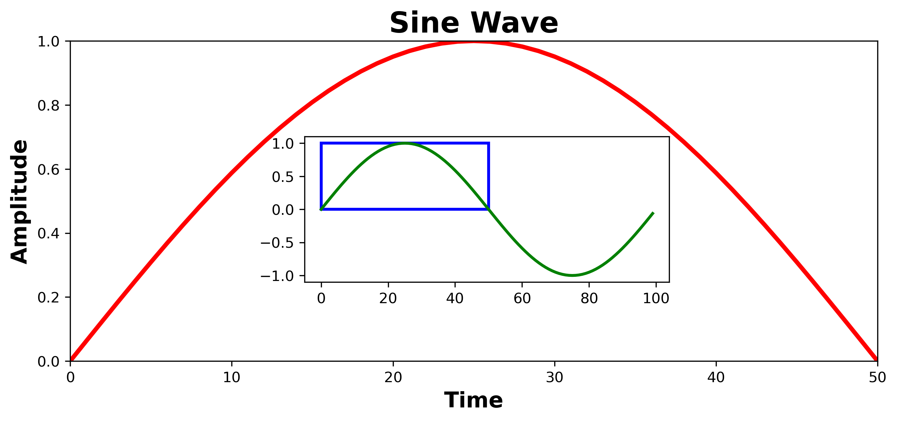
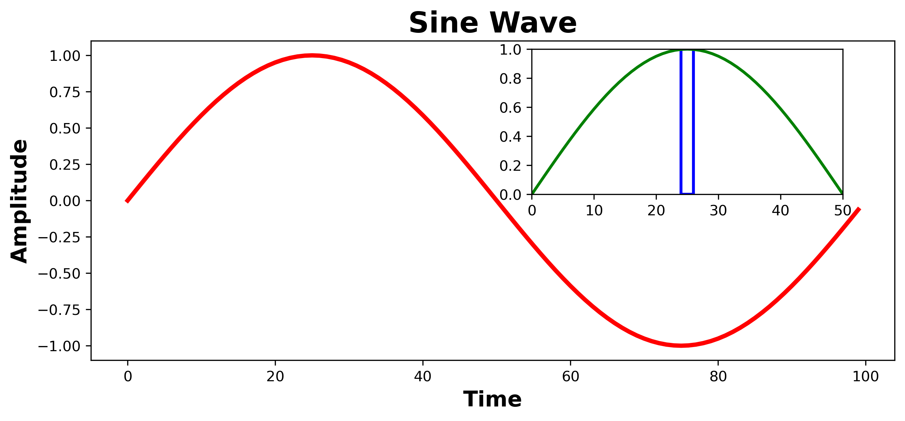

# Inset plotting using Matplotlib

In this video, I tried to show how inset plotting can be done using a very simple example with the help of __Matplotlib__ library . We can call a plot _inset_ when it is inserted within a larger plot.

You will find two figures in this directory: `Fig1.png` & `Fig2.png`.

In __figure 1__, I used the zoomed-in view of a certain potion of the original figure as the larger plot and used the main figure as the inset. However, in __figure 2__, I chose the main figure as the larger plot and selected a highlighted portion as the inset.

### It obviously depends on how you want to represent your plot. The full code is available in `inset_plot.ipynb` file. 
